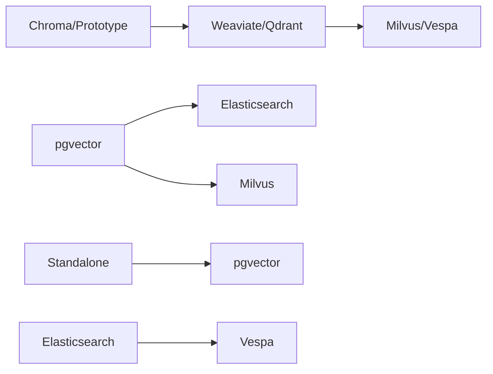

# Final Recommendations and Decision Matrix

## Executive Summary

Based on comprehensive analysis of seven vector database systems across algorithms, performance, APIs, and ecosystems, this document provides final recommendations and a decision matrix to guide selection. Each system has distinct strengths and optimal use cases.

## 1. System Summary Cards

### 1.1 pgvector
**Strengths:**
- Seamless PostgreSQL integration
- SQL-native operations
- Mature ecosystem
- Type-based quantization (halfvec, bit)

**Weaknesses:**
- Limited horizontal scalability
- No native sharding
- Basic HNSW implementation
- No GPU support

**Best For:**
- PostgreSQL-based applications
- Hybrid transactional/vector workloads
- Teams with SQL expertise
- Small to medium datasets (<100M vectors)

### 1.2 Chroma
**Strengths:**
- Extremely simple to use
- Quick prototyping
- Python-first design
- Minimal setup

**Weaknesses:**
- Limited native sharding/replication
- Performance bottlenecks on very large datasets
- Fewer production features than mature systems
- Core performance is inherited from `hnswlib`, limiting both customization and ultimate scalability.

**Best For:**
- Proof of concepts
- Educational projects
- Small prototypes
- Python-only applications

### 1.3 Elasticsearch
**Strengths:**
- Mature distributed system
- Comprehensive ecosystem
- Excellent full-text + vector search
- Enterprise features

**Weaknesses:**
- JVM overhead
- Complex configuration
- Resource intensive
- GC-related latency

**Best For:**
- Enterprise search applications
- Hybrid search requirements
- Existing Elastic stack users
- Large-scale deployments

### 1.4 Vespa
**Strengths:**
- Best-in-class performance
- Advanced algorithms (two-phase search)
- Excellent resource efficiency
- Native multi-modal support

**Weaknesses:**
- High complexity
- Steep learning curve
- Limited community
- Complex configuration

**Best For:**
- High-performance requirements
- Large-scale systems (>1B vectors)
- Complex ranking needs
- Performance-critical applications

### 1.5 Weaviate
**Strengths:**
- GraphQL API
- Good developer experience
- Real-time updates
- Module ecosystem

**Weaknesses:**
- Go GC overhead
- GraphQL learning curve
- Resource usage at scale

**Best For:**
- Modern applications
- GraphQL ecosystems
- Real-time applications
- Mid-scale deployments

### 1.6 Qdrant
**Strengths:**
- Excellent performance
- Memory efficient
- Modern Rust implementation
- Strong filtering
- Vulkan-based GPU acceleration

**Weaknesses:**
- Smaller ecosystem
- Limited enterprise features
- Newer system
- Fewer integrations

**Best For:**
- Performance-sensitive applications
- Resource-constrained environments
- Modern cloud-native stacks
- Growing applications

### 1.7 Milvus
**Strengths:**
- GPU acceleration
- Comprehensive features
- Large-scale proven
- Multiple index types

**Weaknesses:**
- Complex architecture
- Higher operational overhead
- Resource requirements
- Steeper learning curve

**Best For:**
- Very large scale (>1B vectors)
- GPU-accelerated workloads
- Feature-rich requirements
- Distributed deployments

## 2. Decision Matrix

### 2.1 Use Case Based Selection

| Use Case | Primary Choice | Secondary Choice | Avoid |
|----------|---------------|------------------|-------|
| **Quick Prototype** | Chroma | Weaviate | Vespa, Milvus |
| **PostgreSQL Integration** | pgvector | - | All others |
| **Enterprise Search** | Elasticsearch | Milvus | Chroma |
| **High Performance** | Vespa | Qdrant | Chroma |
| **Resource Constrained** | Qdrant | pgvector | Elasticsearch |
| **Large Scale (>1B)** | Milvus | Vespa | Chroma, pgvector |
| **Real-time Updates** | Weaviate | Qdrant | Chroma |
| **Hybrid Search** | Elasticsearch | pgvector | Chroma |
| **GPU Workloads** | Milvus | Qdrant | All others |
| **Simple Operations** | pgvector | Weaviate | Vespa |

### 2.2 Technical Requirements Matrix

| Requirement | pgvector | Chroma | Elasticsearch | Vespa | Weaviate | Qdrant | Milvus |
|------------|----------|--------|---------------|-------|----------|--------|--------|
| Performance | ★★★☆☆ | ★☆☆☆☆ | ★★★☆☆ | ★★★★★ | ★★★★☆ | ★★★★☆ | ★★★★☆ |
| Scalability | ★★☆☆☆ | ★☆☆☆☆ | ★★★★★ | ★★★★★ | ★★★☆☆ | ★★★★☆ | ★★★★★ |
| Ease of Use | ★★★★★ | ★★★★★ | ★★★☆☆ | ★☆☆☆☆ | ★★★★☆ | ★★★★☆ | ★★★☆☆ |
| Features | ★★★☆☆ | ★★☆☆☆ | ★★★★★ | ★★★★★ | ★★★★☆ | ★★★★☆ | ★★★★★ |
| Ecosystem | ★★★★★ | ★★☆☆☆ | ★★★★★ | ★★★☆☆ | ★★★★☆ | ★★★☆☆ | ★★★★☆ |
| Cost Efficiency | ★★★★☆ | ★★★☆☆ | ★★★☆☆ | ★★★★★ | ★★★☆☆ | ★★★★★ | ★★★☆☆ |
| Stability | ★★★★★ | ★★☆☆☆ | ★★★★★ | ★★★★☆ | ★★★☆☆ | ★★★☆☆ | ★★★★☆ |

### 2.3 Organizational Fit

| Organization Type | Recommended Systems | Rationale |
|------------------|-------------------|-----------|
| **Startup (Early)** | Chroma → Weaviate/Qdrant | Start simple, migrate when scaling |
| **Startup (Growth)** | Weaviate, Qdrant | Balance of features and simplicity |
| **SMB** | pgvector, Weaviate | Cost-effective, manageable |
| **Enterprise** | Elasticsearch, Milvus | Proven scale, support, features |
| **Tech Company** | Vespa, Qdrant, Milvus | Performance, modern architecture |
| **Research** | Milvus, Vespa | Advanced features, flexibility |

## 3. Migration Paths

### 3.1 Common Migration Patterns



### 3.2 Migration Difficulty

| From → To | Difficulty | Data Migration | Code Changes | Downtime |
|-----------|-----------|----------------|--------------|----------|
| Chroma → Weaviate | Easy | Simple | Moderate | Minimal |
| Chroma → Qdrant | Easy | Simple | Moderate | Minimal |
| pgvector → Milvus | Hard | Complex | Significant | Required |
| Weaviate → Milvus | Medium | Moderate | Moderate | Minimal |
| Any → pgvector | Medium | Moderate | Significant | Required |
| Elasticsearch → Vespa | Hard | Complex | Significant | Required |

## 4. Cost Analysis

### 4.1 Total Cost of Ownership (TCO)

| System | Infrastructure | Operations | Development | Support | 3-Year TCO* |
|--------|---------------|------------|-------------|---------|-------------|
| pgvector | Low | Low | Low | Low | $50-100K |
| Chroma | Low | Low | Low | Available (Cloud) | $30-50K |
| Elasticsearch | High | High | Medium | High | $300-500K |
| Vespa | Medium | High | High | Medium | $200-400K |
| Weaviate | Medium | Medium | Low | Medium | $150-250K |
| Qdrant | Low | Low | Low | Medium | $100-200K |
| Milvus | High | High | High | High | $250-450K |

*Estimated for 100M vectors, includes all costs

### 4.2 Cost-Performance Ratio

**Best Value:**
1. Qdrant - Excellent performance per dollar
2. pgvector - Low cost, adequate performance
3. Vespa - High performance justifies cost

**Premium Options:**
1. Elasticsearch - High cost, comprehensive features
2. Milvus - High cost, specialized features

**Budget Option:**
1. Chroma - Lowest cost, limited scale

## 5. Risk Assessment

### 5.1 Technical Risks

| System | Vendor Lock-in | Technical Debt | Scalability Limits | Maintenance |
|--------|---------------|----------------|-------------------|-------------|
| pgvector | Low | Low | High | Low |
| Chroma | Medium | High | Very High | Low |
| Elasticsearch | Low | Medium | Low | High |
| Vespa | High | Low | Low | High |
| Weaviate | Medium | Low | Medium | Medium |
| Qdrant | Low | Low | Low | Low |
| Milvus | Medium | Medium | Low | High |

### 5.2 Business Risks

| System | Maturity | Community | Commercial Support | Future Proof |
|--------|----------|-----------|-------------------|--------------|
| pgvector | High | Huge* | Available | High |
| Chroma | Low | Small | Available (Cloud) | Medium |
| Elasticsearch | Very High | Huge | Excellent | High |
| Vespa | High | Medium | Good | High |
| Weaviate | Medium | Growing | Good | High |
| Qdrant | Medium | Growing | Growing | High |
| Milvus | High | Large | Good | High |

*Via PostgreSQL

## 6. Final Recommendations

### 6.1 Default Choices by Scenario

**"I need vector search in my PostgreSQL app"**
→ **pgvector** (only viable option)

**"I need to build a quick prototype"**
→ **Chroma** (simplest start)

**"I need production-ready with minimal complexity"**
→ **Weaviate** (best balance)

**"I need maximum performance"**
→ **Vespa** (if you can handle complexity)
→ **Qdrant** (simpler alternative)

**"I need enterprise features and support"**
→ **Elasticsearch** (most mature)
→ **Milvus** (for pure vector workloads)

**"I have limited resources"**
→ **Qdrant** (most efficient)

### 6.2 Decision Tree

```
Start
├── Using PostgreSQL?
│   └── Yes → pgvector
│   
├── Prototype only?
│   └── Yes → Chroma
│   
├── Need hybrid search?
│   └── Yes → Elasticsearch
│   
├── Scale > 1B vectors?
│   ├── Yes → Performance critical?
│   │   ├── Yes → Vespa
│   │   └── No → Milvus
│   └── No → Continue
│   
├── Resource constrained?
│   └── Yes → Qdrant
│   
└── Default → Weaviate
```

### 6.3 Anti-Patterns to Avoid

1. **Don't use Chroma for production** - It's a prototype tool
2. **Don't use pgvector for billions of vectors** - It won't scale horizontally
3. **Don't use Vespa unless you need it** - Complexity isn't worth it for simple use cases
4. **Don't ignore operational costs** - Elasticsearch and Milvus require significant ops
5. **Don't over-engineer** - Start simple, migrate when needed

## 7. Future Outlook

### 7.1 Technology Trends

- **GPU Acceleration**: Becoming standard (Milvus, Qdrant)
- **Rust Adoption**: Performance benefits proven (Qdrant)
- **Serverless**: Emerging (Weaviate Cloud, Qdrant Cloud)
- **Multi-modal**: Growing importance (Vespa leading)

### 7.2 Market Evolution

**Winners:**
- Qdrant and Weaviate (modern, balanced)
- pgvector (PostgreSQL integration)
- Elasticsearch (enterprise incumbent)

**Challenged:**
- Chroma (must evolve beyond prototype)
- Vespa (complexity limits adoption)

**Wild Cards:**
- New entrants with novel approaches
- Major cloud providers' offerings

## 8. Conclusion

There is no single "best" vector database. The optimal choice depends on:

1. **Technical requirements** (scale, performance, features)
2. **Organizational context** (skills, existing stack)
3. **Resource constraints** (budget, operations)
4. **Time horizon** (prototype vs. long-term)

**For most organizations**, start with:
- **Weaviate** or **Qdrant** for greenfield projects
- **pgvector** if using PostgreSQL
- **Elasticsearch** if you need hybrid search

**Avoid** Chroma for anything beyond prototypes, and carefully consider whether Vespa's complexity is justified for your use case.

The vector database space is rapidly evolving. Revisit your choice annually and plan for potential migration as your needs grow.